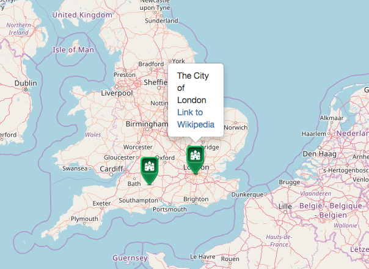

# Open Layers: Display Markers/Icons on Map
The repository contains derivative work of the OpenLayers Example  that is able to display a set of icons on a map. The set of georeferrenced icons can be generated with openlayers_selectgeolocation.

## [Demo Markers Display](https://niebert.github.io/openlayer_display_markers/)

## Repositories
The following repositories use [openlayer_display_markers](https://niebert.github.io/openlayer_display_markers/) to display markers with a specific popup for each icon.

* [Markers4Map](https://www.github.com/niebert/Markers4Map) - [Demo](https://niebert.github.io/Markers4Map) - is a [JSON Editor](https://www.github.com/niebert/jsoneditor) to create markers/icons with popup information for each icon. JSON-Editor is used to [select a location](ttps://www.github.com/niebert/openlayer_selectlocation) on the map and popuplate the popup text and the link for additional information about  the selected location.
* [Mapper4SDG](https://www.github.com/niebert/Mapper4SDG) - [Demo](https://niebert.github.io/Mapper4SDG) - is a [JSON Editor](https://www.github.com/niebert/jsoneditor) to create markers/icons with popup information for each icon. JSON-Editor is used to [select a location](ttps://www.github.com/niebert/openlayer_selectlocation) on the map and popuplate the popup information and link for extended information for the selected location.

## Derivative Works of OpenLayers: Icon Symbolizer
The repository is based on the [OpenLayers example](http://openlayers.org/en/latest/examples/icon.html)

## LinkParameter Library: linkparam.js
This library allows to submit the marker data via URL parameter. Furthermore you can submit the zoom factor of the map and the map centre.

### Demo
* [Geolocation Select Demo](https://niebert.github.io/openlayer_display_markers)
* [Download Display Markers Demo](https://github.com/niebert/openlayer_display_markers/archive/master.zip) unzip file and checkout the subdirectory `/docs`. The demo is stored in `/docs` because it is used at the same time as root directory for https://niebert.github.io/openlayer_display_markers
* [Download Select Location Demo](https://github.com/niebert/openlayer_selectlocation/archive/master.zip) unzip file and checkout the subdirectory `/docs`. The demo is stored in `/docs` because it is used at the same time as root directory for https://niebert.github.io/openlayer_selectlocation

## Other related GitHub Project
* [OpenLayers Select Geolocation](https://github.com/niebert/openlayer_selectlocation) -- [WebApp](https:/niebert.github.io/openlayer_selectlocation)
* [Mapper for Sustainable Devlopment Goals](https://github.com/niebert/Mapper4SDG) -- [WebApp](https:/niebert.github.io/Mapper4SDG)
* [Markers4Map](https://github.com/niebert/Markers4Map) -- [WebApp](https:/niebert.github.io/MMarkers4Map)
